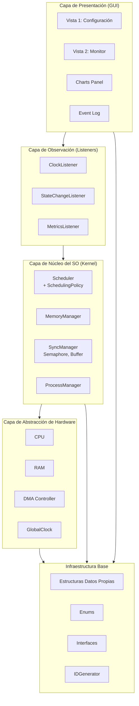
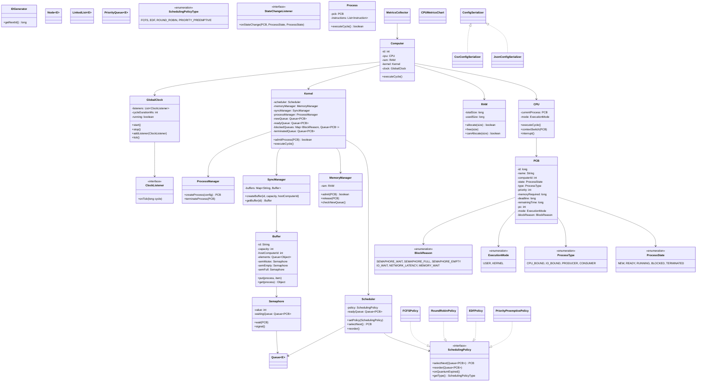
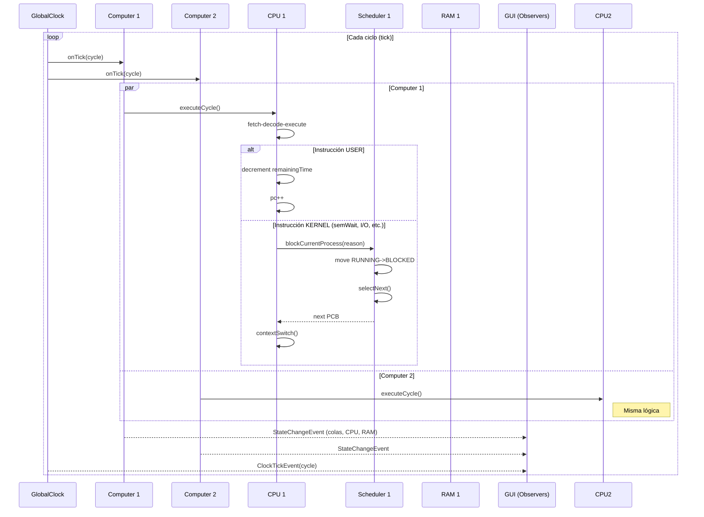
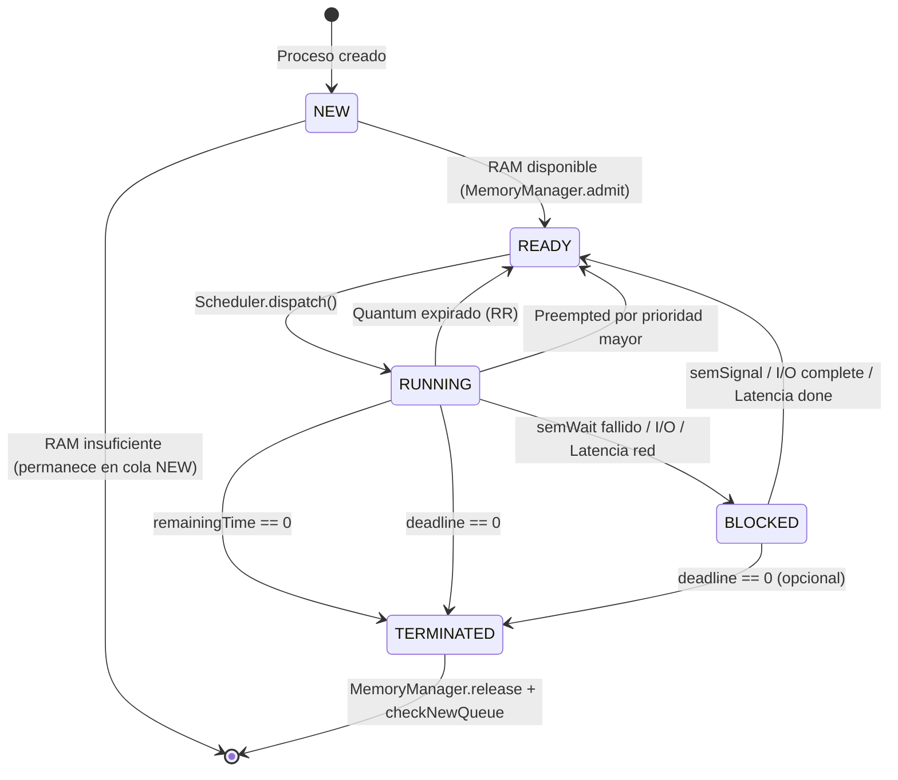

# Arquitectura ÁvilaOS - Diagrama de Capas y Componentes

## 1. Vista de Capas (Layered Architecture)



**Regla de dependencia:** Cada capa solo conoce a la inmediatamente inferior. La GUI **nunca** llama directamente al Kernel; usa Listeners/Observers.

---

## 2. Diagrama de Clases Principal (Simplificado)



---

## 3. Diagrama de Secuencia: Ciclo de Reloj Global



---

## 4. Diagrama de Estados: Proceso (ProcessState)



---

## 5. Diagrama de Secuencia: Productor-Consumidor (Acceso Remoto)

```mermaid
sequenceDiagram
    participant P as Productor (Computer 1)
    participant B as Buffer (Computer 2)
    participant S1 as semEmpty
    participant S2 as semMutex
    participant S3 as semFull
    participant C as Consumidor (Computer 1)

    Note over P,B: Productor en C1, Buffer en C2 (remoto)
    
    P->>B: put(item)
    B->>P: BLOQUEAR por NETWORK_LATENCY (ej. 3 ciclos)
    Note right of P: Estado BLOCKED, reason=NETWORK_LATENCY
    ... 3 ciclos después ...
    P->>S1: semWait(empty)
    alt empty > 0
        S1-->>P: OK
        P->>S2: semWait(mutex)
        S2-->>P: OK
        P->>B: buffer.add(item)
        P->>S2: semSignal(mutex)
        P->>S3: semSignal(full)
    else empty == 0
        S1->>P: BLOQUEAR en cola semEmpty
        Note right of P: Estado BLOCKED, reason=SEMAPHORE_EMPTY
    end

    Note over C,B: Consumidor en C1, Buffer en C2 (remoto)
    C->>B: get()
    B->>C: BLOQUEAR por NETWORK_LATENCY
    ... latencia ...
    C->>S3: semWait(full)
    alt full > 0
        S3-->>C: OK
        C->>S2: semWait(mutex)
        S2-->>C: OK
        C->>B: item = buffer.remove()
        C->>S2: semSignal(mutex)
        C->>S1: semSignal(empty)
    else full == 0
        S3->>C: BLOQUEAR en cola semFull
    end
```

---

## 6. Estructura de Paquetes (Maven)

```
avilaos/
├── src/main/java/avilaos/
│   ├── model/
│   │   ├── enumeration/
│   │   │   ├── ProcessState.java
│   │   │   ├── ProcessType.java
│   │   │   ├── SchedulingPolicyType.java
│   │   │   ├── ExecutionMode.java
│   │   │   └── BlockReason.java
│   │   ├── interfaces/
│   │   │   ├── SchedulingPolicy.java
│   │   │   ├── ClockListener.java
│   │   │   ├── StateChangeListener.java
│   │   │   └── MetricsListener.java
│   │   ├── dto/
│   │   │   ├── ProcessConfig.java
│   │   │   ├── BufferConfig.java
│   │   │   ├── ComputerConfig.java
│   │   │   └── SimulationConfig.java
│   │   └── pcb/
│   │       └── PCB.java
│   ├── util/
│   │   ├── datastructures/
│   │   │   ├── Node.java
│   │   │   ├── LinkedList.java
│   │   │   ├── Queue.java
│   │   │   └── PriorityQueue.java
│   │   └── IDGenerator.java
│   ├── core/
│   │   ├── clock/
│   │   │   └── GlobalClock.java
│   │   ├── hardware/
│   │   │   ├── Computer.java
│   │   │   ├── CPU.java
│   │   │   └── RAM.java
│   │   └── process/
│   │       └── Process.java
│   ├── kernel/
│   │   ├── scheduler/
│   │   │   ├── Scheduler.java
│   │   │   ├── FCFSPolicy.java
│   │   │   ├── RoundRobinPolicy.java
│   │   │   ├── EDFPolicy.java
│   │   │   └── PriorityPreemptivePolicy.java
│   │   ├── memory/
│   │   │   └── MemoryManager.java
│   │   ├── sync/
│   │   │   ├── Semaphore.java
│   │   │   ├── Buffer.java
│   │   │   └── SyncManager.java
│   │   ├── process/
│   │   │   └── ProcessManager.java
│   │   └── Kernel.java
│   ├── metrics/
│   │   ├── MetricsCollector.java
│   │   └── CPUMetricsChart.java
│   ├── persistence/
│   │   ├── ConfigSerializer.java
│   │   ├── JsonConfigSerializer.java
│   │   └── CsvConfigSerializer.java
│   └── gui/
│       ├── Vista1Config.java
│       ├── Vista2Monitor.java
│       ├── components/
│       │   ├── ComputerPanel.java
│       │   ├── QueueTableModel.java
│       │   ├── BufferTableModel.java
│       │   └── MetricsChartPanel.java
│       └── controllers/
│           ├── ConfigController.java
│           └── MonitorController.java
└── src/test/java/avilaos/
    ├── util/datastructures/
    ├── kernel/scheduler/
    └── kernel/sync/
```

---

## 7. Flujo de Datos Principal

```
┌─────────────┐     ┌──────────────┐     ┌─────────────┐
│  GlobalClock │────▶│   Computer   │────▶│     CPU     │
│  (tick)      │     │  (execute)   │     │ (instr.)    │
└─────────────┘     └──────────────┘     └──────┬──────┘
                           ▲                    │
                           │                    ▼
                    ┌──────┴──────┐     ┌─────────────┐
                    │   Kernel    │     │  Scheduler  │
                    │  (coordinar)│     │ (selectNext)│
                    └──────┬──────┘     └──────┬──────┘
                           │                   │
              ┌────────────┼────────────┐      │
              ▼            ▼            ▼      ▼
         ┌─────────┐ ┌──────────┐ ┌──────────┐ ┌─────────┐
         │MemoryMgr│ │SyncManager│ │ProcessMgr│ │ Queues  │
         └─────────┘ └──────────┘ └──────────┘ └─────────┘
              │            │            │
              ▼            ▼            ▼
         ┌─────────┐ ┌──────────┐ ┌──────────┐
         │   RAM   │ │ Buffers  │ │  PCB     │
         └─────────┘ └──────────┘ └──────────┘
                           │
                           ▼
                    ┌──────────────┐
                    │  Semaphores  │
                    │ (wait/signal)│
                    └──────────────┘
```

---

## 8. Decisiones de Diseño Clave

| Decisión | Justificación |
|----------|---------------|
| **Computer como clase única, N instancias** | Requisito obligatorio: "agregar computador = nueva instancia" |
| **PCB = TCB (monohilo)** | Requisito: "un solo hilo por proceso, PCB integra TCB 1:1" |
| **Semáforos propios (no java.util.concurrent)** | Requisito: "implementación queda a su elección pero parte de ÁvilaOS" |
| **Estructuras de datos propias** | Requisito: "prohibido java.util.ArrayList, Queue, Stack, Vector" |
| **Interfaces para políticas** | Requisito: "agregar política nueva no requiere modificar planificador" |
| **GlobalClock como singleton con listeners** | Desacopla reloj de computadores; GUI se suscribe |
| **GUI como Observer pura** | "Interfaz debe observar al sistema, no ser el sistema" (Proyecto 2) |
| **Enums para conjuntos fijos** | Requisito obligatorio + switch exhaustivo compile-time |
| **DTOs records para persistencia** | Inmutables, serializables, menos boilerplate |

---

## 9. Puntos de Extensión (Proyecto 2)

| Componente | Preparación para Proyecto 2 |
|------------|----------------------------|
| `MemoryManager` | Añadir `VirtualMemoryManager` que herede/decore, agregar `suspendProcess()` |
| `Process` / `PCB` | Añadir `pageTable`, `diskBlocks`, `suspended` state |
| `SyncManager` | Añadir `DiskBuffer`, `FileSemaphore` |
| `GlobalClock` | Añadir `diskIOCycles`, `pageFaultHandler` |
| `GUI` | Nueva pestaña "Disco/Memoria Virtual", gráficas de page faults |

---

*Documento vivo - actualizar cuando cambie la arquitectura*